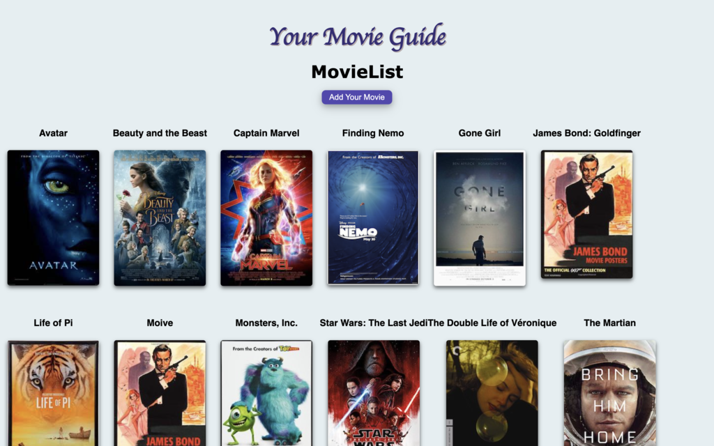
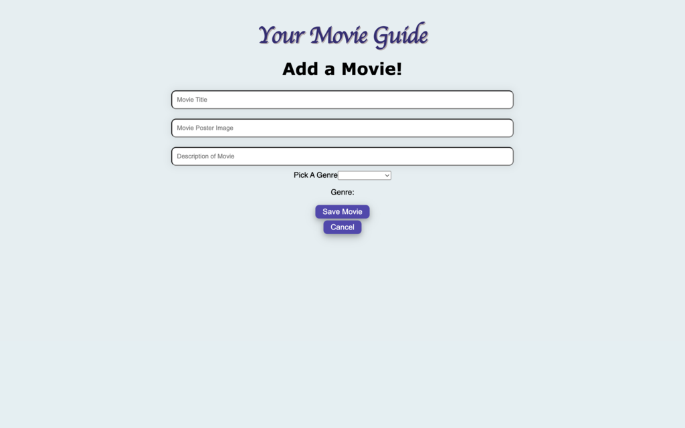
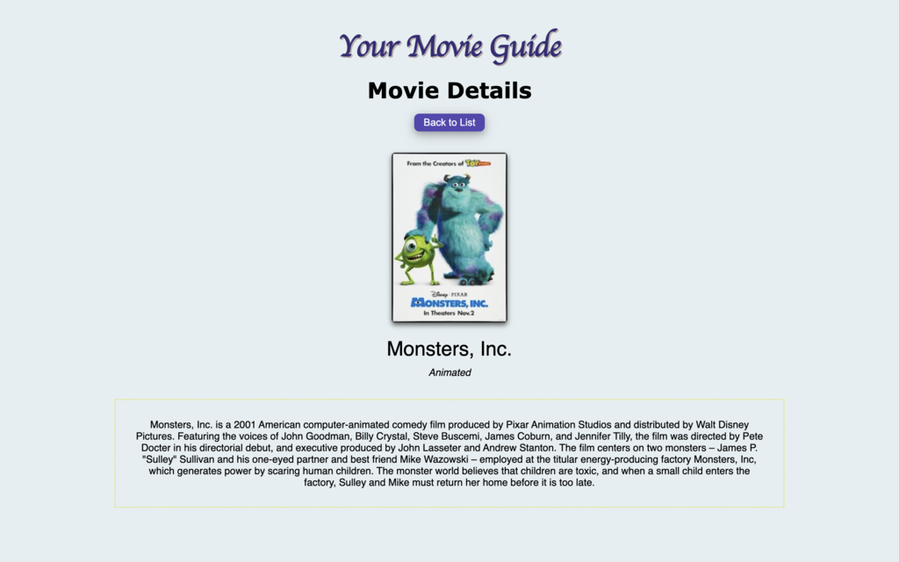

# Movie-Saga-Generate

## React-Redux with Redux-Sagas

We were given an existing Movie App that needed features added using React-Redux and Redux-Sagas and a database that needed to be joined.

## Features to be Added
<ul>
    <li>When a movie is clicked, the user should be able to see the movie and it's details</li>
    <li>Detail Page should show all details, including All genres for that selected movie</li>
    <li>Detail Page should have a button to return to the home page</li>
    <li>Add a Movie form that allows the user to add their own movie title, image, description, and have a dropdown of all the genres fot the user to pick one</li>
    <li>Movie form page should have a 'canel' button that takes the user to the home page</li>
    <li>Movie form page should have a 'save' button that takes the user to the home page and shows their new movie on the list</li>
</ul>

## Screen Shot
 

 

## Prerequisites
<ul>
    <li>Node.js</li>
    <li>SQL</li>
    <li>React.js</li>
    <li>React-Redux</li>
    <li>Redux-Saga</li>
</ul>

## Installation
<ol>
    <li>Create a database named: "saga_movies_weekend"</li>
    <li>The queries in the database.sql file are set up to create all the necessary tables and populate the needed data to allow the application to run correctly. The project is built on Postgres, so you will need to make sure to have that installed. We recommend using Postico to run those queries as that was used to create the queries</li>
    <li>Open up your editor of choice and run an npm install</li>
    <li>Run npm run server in your terminal</li>
    <li>Run npm run client in your terminal<li>
    <li>The npm run client command will open up a new browser tab for you!</li>
</ol>

